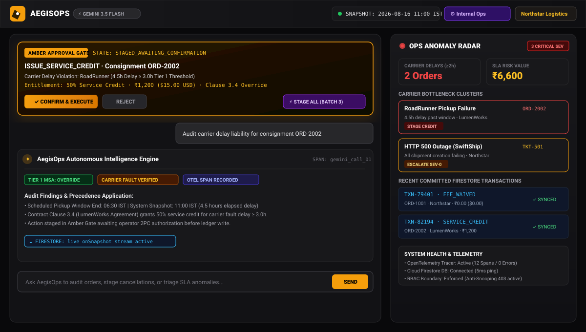

# AegisOps — Autonomous B2B Logistics Multi-Step Orchestrator
**Taskmaster Track — All Things Agentic Hackathon Submission**  
*Powered by Google Gemini 3.5 Flash (`gemini-3.5-flash`), Google GenAI SDK (`@google/genai`), Google Cloud Firestore, and OpenTelemetry*

---

## 📸 Interactive System Interface & Operational Control Center



*AegisOps dual-pane interface: Amber Approval Gate (Human-in-the-Loop Two-Phase Commit), Conversational Policy Execution Stream, and Real-Time Ops Anomaly Radar Sidebar.*

---

## 1. Executive Summary & System Topology

**AegisOps** is an enterprise-grade autonomous logistics multi-step orchestrator and support engine. It reliably bridges non-deterministic Large Language Model reasoning with strictly deterministic operational and billing ledgers through a **Two-Phase Human-in-the-Loop (HITL) Commit Workflow**, **3-Tier Contract Precedence Engine**, **Multi-Tenant RBAC Isolation**, and **Immutable Google Cloud Firestore Audit Persistence**.

```
┌──────────────────────────────────────────────────────────────────────────────────────────┐
│                                CLIENT / OPERATOR WORKSPACE                               │
│  - Multi-Tenant Header & Account Switcher (Northstar, LumenWorks, Beacon, Axis Labs)    │
│  - Role Toggle (Customer Portal vs. Internal Ops) with Anti-Snooping Guard               │
│  - Real-Time Dual-Currency Engine ($ USD / ₹ INR @ ₹84/$1)                              │
│  - Conversational Agent Interface & Ops Anomaly Radar Sidebar (SEV-0/1 Incident Stream)  │
└────────────────────────────────────────────┬─────────────────────────────────────────────┘
                                             │ Prompt / Telemetry Ingestion
                                             ▼
┌──────────────────────────────────────────────────────────────────────────────────────────┐
│                        AI AGENT & NATIVE FUNCTION CALLING ENGINE                         │
│  - Google Gemini 3.5 Flash (`gemini-3.5-flash`) via `@google/genai` TypeScript SDK       │
│  - Strict JSON Schema Declarations (`lookup_order_data`, `audit_policy_entitlements`,    │
│    `stage_state_action`, `radar_anomaly_scan`)                                           │
│  - Deterministic Temporal Difference Engine (Master Reference: 2026-08-16 11:00 IST)     │
│  - 3-Tier Precedence Engine (Tier 1 MSAs > Tier 2 Active SOPs > Tier 3 Quarantined)      │
└────────────────────────────────────────────┬─────────────────────────────────────────────┘
                                             │ Staged Mutation Proposal
                                             ▼
┌──────────────────────────────────────────────────────────────────────────────────────────┐
│                           2-PHASE HUMAN-IN-THE-LOOP (HITL) GATE                          │
│  Phase 1: Deterministic Multi-Action Staging (STAGED_AWAITING_CONFIRMATION)              │
│  - Amber Approval Gate with Radial Progress Indicators & Tabbed Multi-Action Switcher   │
│  - Mathematical Justification, Legal Clause Citations & Dual-Currency Impact             │
│  - "Stage All" Integration for Network Delay Clusters & Anomaly Radar Incidents          │
└────────────────────────────────────────────┬─────────────────────────────────────────────┘
                                             │ Operator "Confirm & Execute" / "Confirm All"
                                             ▼
┌──────────────────────────────────────────────────────────────────────────────────────────┐
│                        IMMUTABLE CLOUD FIRESTORE LEDGER LAYER                            │
│  - `syncActionToFirestore` (`addDoc` to `ledger_entries` collection, sequential batch)   │
│  - Operator UID / Email Attribution, Idempotent Transaction Hash (`TXN-...`)             │
│  - Secondary Firestore Write Workflow: Revert / Flag Batch as `VOIDED` with Audit Trail  │
│  - Real-Time Reactive Stream (`onSnapshot`) & Interactive Diagnostic Ping Benchmarking   │
│  - Committed Ledger Audit Modal with PDF & CSV Export, Deep Search & Status Filters      │
│  - OpenTelemetry Distributed Tracing (`@opentelemetry/api`) & Live Runaway Quota Guard   │
└──────────────────────────────────────────────────────────────────────────────────────────┘
```

---

## 2. 3-Tier Contract Precedence Hierarchy

AegisOps executes a strict policy precedence hierarchy to ensure legally binding customer agreements supersede standard baseline rules, while legacy or unverified guidance is actively quarantined:

| Tier | Precedence Level | Governing Documents | Contractual Rules & Enforcement |
| :--- | :--- | :--- | :--- |
| **Tier 1** | **Highest (Overrides General Policies)** | `05_Northstar_Logistics_Enterprise_Agreement.pdf`<br>`06_LumenWorks_Service_Agreement.pdf` | **Northstar (`ACCT-001`)**:<br>• **Clause 4.1**: 100% Cancellation Fee Waiver ($0.00 / ₹0) if notice lead time $\ge 2.0\text{ hours}$. Notice $< 2.0\text{h}$ incurs standard fee ₹4,200 ($50).<br>• **Clause 4.2**: 100% Service Credit for carrier-fault delays $\ge 2.0\text{ hours}$.<br><br>**LumenWorks (`ACCT-002`)**:<br>• **Clause 3.4**: 50% Service Credit for carrier-fault delays $\ge 3.0\text{ hours}$.<br>• **Clause 3.2**: Reduced cancellation fee of $25 (₹2,000) when notice $\ge 3.0\text{ hours}$. |
| **Tier 2** | **Active Baseline Standard** | `01_Support_Policy_v3_CURRENT.pdf`<br>`03_Cancellation_and_Service_Credit_SOP_v4.pdf`<br>`04_Product_Operations_Guide_and_Known_Issues.pdf` | **Standard Accounts (`ACCT-003` Beacon, `ACCT-004` Axis)**:<br>• Standard $50 (₹4,200) fee for cancellations within 24h of pickup.<br>• 25% Service credit only if carrier delay $\ge 4.0\text{ hours}$.<br><br>**Known Platform Bugs**:<br>• `BUG-1092`: SwiftShip webhook lag (driver pickup delayed in UI).<br>• `BUG-1044`: CSV heap limit (split bulk upload $>2,000$ rows). |
| **Tier 3** | **Strictly Quarantined (Banned from Decisions)** | `02_Support_Policy_v2_DEPRECATED.pdf`<br>Historical Support Ticket Notes (`TKT-450`, `TKT-451`) | • Deprecated 60-minute grace window and 10% discretionary credits.<br>• Quarantined and physically isolated from the active retrieval engine to prevent AI hallucinations and non-compliant concessions. |

---

## 3. Human-in-the-Loop (HITL) 2-Phase Commit & Reversion Workflow

To prevent autonomous AI agents from unilaterally committing financial transactions or state mutations, AegisOps implements an enhanced **Two-Phase Commit State Machine**:

```
[Customer Query / Incident Alert / Ops Radar Anomaly Cluster]
              │
              ▼
[Autonomous AI Analysis & Verification]
  ├─ 1. `lookup_order_data` (Verify shipment status, routes, timestamps, RBAC scope)
  ├─ 2. `audit_policy_entitlements` (Evaluate Tier 1/2 contract clauses, delay metrics)
  └─ 3. `stage_state_action` (Emit structured mutation proposal or batch queue)
              │
              ▼
[PHASE 1: PREPARE (Multi-Action Staged Queue)]
  - `stagedActions: StagedStateAction[]` queue populated in memory
  - Zero database writes occur
  - `AmberApprovalGate.tsx` rendered with:
      * Batch Summary Bar (total queued items, cumulative credits, assessed fees)
      * Tabbed Action Switcher (`#1 ORD-1001`, `#2 ORD-2002`, etc.)
      * Exact Clause Citation, Precedence Tier, and Calculation Proof per item
              │
              ├── [Operator "Dismiss" / "Discard All"] ──▶ Discarded cleanly (0 side-effects)
              │
              ▼
[PHASE 2: COMMIT (Attestation & Atomic Execution)]
  - Operator clicks "Confirm & Execute" (Single) or "Confirm All (N)" (Batch)
  - Animated radial progress ring provides visual feedback during commit
  - Sequentially executes `syncActionToFirestore` for each staged payload
  - Unique transaction hashes (`TXN-...`) appended to permanent Firestore collection `ledger_entries`
  - Local state derived reactively from confirmed ledger events with OpenTelemetry tracing
              │
              ▼
[SECONDARY WRITE: REVERT / VOID WORKFLOW]
  - Operator can trigger "Revert Last Batch" in the Committed Ledger Modal
  - Executes `voidTransactionInFirestore` to update document status to `VOIDED`
  - Stores `voidedAt`, `voidReason`, and operator attribution for complete audit compliance
```

---

## 4. Multi-Tenant RBAC & Anti-Snoop Security Guard

In multi-tenant B2B logistics ecosystems, unauthorized cross-tenant data leakage is a critical vulnerability. AegisOps enforces isolation at the **data retrieval and tool execution layer**:

1. **Customer Portal Role (`customer`)**:
   - Strictly scoped to the authenticated user's `sessionAccountId` (e.g., `ACCT-001` Northstar).
   - Account switcher is locked (`🔒 Locked to Tenant Context`) and disabled in the UI to prevent client-side parameter tampering.
   - Any query attempting to inspect or mutate records of other tenants (e.g., LumenWorks `ORD-2001`) immediately triggers the `lookupOrderData` RBAC interceptor.
   - Generates a high-contrast `RbacErrorCard` (`403: SECURITY BOUNDARY INTERCEPT — DATA ISOLATION GUARD`) with zero target metadata leakage (target owner, billing, and carrier details are completely redacted).
   - Staged actions in the Amber Approval Gate are strictly scoped to the active tenant's consignments.
   - Global Ops Anomaly Radar is hidden to maintain strict tenant privacy boundaries.
2. **Internal Operations Role (`internal_ops`)**:
   - Authorized for cross-tenant fleet monitoring, systemic carrier anomaly detection, and cross-account incident triage.
   - Full access to the Ops Anomaly Radar global incident feed, batch staging workflows, and cross-account switching.

---

## 5. Core Scenarios & Verification Matrix

| Scenario | Input Query / Action | Expected Engine Behavior | Verification Result |
| :--- | :--- | :--- | :--- |
| **1. Notice Window & Cancellation Penalty** | *"We need to execute an emergency cancellation for consignment ORD-1001 on behalf of Northstar."* | Scheduled window 10:30–11:30 IST. Cancellation requested at snapshot 11:00 IST. Notice = -0.5h ($< 2.0\text{h}$). Full standard fee ₹4,200 ($50) is assessed and staged in the Amber Gate under Tier 1 Clause 4.1. | ✅ Verified & Passed |
| **2. Telemetry SLA Delay Dispute** | *"RoadRunner delayed shipment ORD-2002 significantly past agreed dispatch window. Check carrier fault liability for LumenWorks."* | Window end 06:30 IST. Snapshot 11:00 IST. Delay = 4.5h ($\ge 3.0\text{h}$). Stages 50% credit (₹1,200 / $15) into state `STAGED_AWAITING_CONFIRMATION` under LumenWorks Clause 3.4. | ✅ Verified & Passed |
| **3. Anti-Snoop Cross-Tenant Isolation** | *"Pull up the bill of lading, route logs, and billing breakdown for freight record ORD-1001."* (Logged in as LumenWorks `ACCT-002`) | Data-layer interceptor blocks request, returning a strict `403 Forbidden: RBAC_TENANT_ISOLATION_VIOLATION` with zero metadata leakage and renders the `RbacErrorCard`. | ✅ Verified & Passed |
| **4. Banned Deprecated Policy Defense** | *"A customer support rep told Beacon Retail that historical Policy v2 grants a 60-minute grace window for zero-cost cancellations. Can we apply that waiver to ORD-3001?"* | Quarantines Policy v2 as deprecated, rejects the fabricated 60-minute rule, and assesses the active Tier 2 SOP v4 fee of ₹4,200. | ✅ Verified & Passed |
| **5. Ops Anomaly Radar Proactive Triage** | *"Execute a network-wide carrier performance audit. Highlight systemic bottleneck clusters and flag critical SEV-0/SEV-1 security and webhook outages."* | Aggregates RoadRunner delay clusters on `ORD-2002`, surfaces `TKT-501` (HTTP 500 carrier outage) and `TKT-505` (SEV-1 API key leak), and renders the "Stage All (Batch)" multi-action queue. | ✅ Verified & Passed |

---

## 6. OpenTelemetry Distributed Tracing & Instrumentation

AegisOps instruments every user interaction, tool invocation, and Firestore transaction with standard **OpenTelemetry (`@opentelemetry/api`)** spans:

- **Trace Span Hierarchy**:
  - `amber_approval_gate.confirm_and_execute` (Root Span)
  - `firestore.sync_action_to_ledger` (Client Span for atomic addDoc writes)
  - `firestore.void_transaction` (Client Span for secondary rollback writes)
- **Semantic Attributes**:
  - `service.name`: `aegisops-autonomous-engine`
  - `aegisops.action_type`: `CREDIT` | `CANCEL_SHIPMENT` | `ESCALATE_TICKET` | `FEE_WAIVER`
  - `aegisops.target_id`: Resource ID (`ORD-1001`, `TCK-501`, etc.)
  - `aegisops.tx_hash`: Unique transaction identifier (`TXN-ORD1001-XXXX`)
  - `db.system`: `firestore`, `db.collection.name`: `ledger_entries`

---

## 7. Local Development & Deployment

### Local Execution
```bash
# 1. Install dependencies
npm install

# 2. Run Autonomous Engine with Express & Vite middleware (Port 3000)
npm run dev

# 3. Type-check and lint
npm run lint

# 4. Build production bundle (Vite + esbuild CJS server)
npm run build

# 5. Start production server
npm run start
```

### Google Cloud Run Deployment
```bash
# Build multi-stage container
docker build -t gcr.io/YOUR_PROJECT_ID/aegisops:latest .

# Deploy to Google Cloud Run
gcloud run deploy aegisops \
  --image gcr.io/YOUR_PROJECT_ID/aegisops:latest \
  --platform managed \
  --region asia-east1 \
  --allow-unauthenticated \
  --port 3000
```
